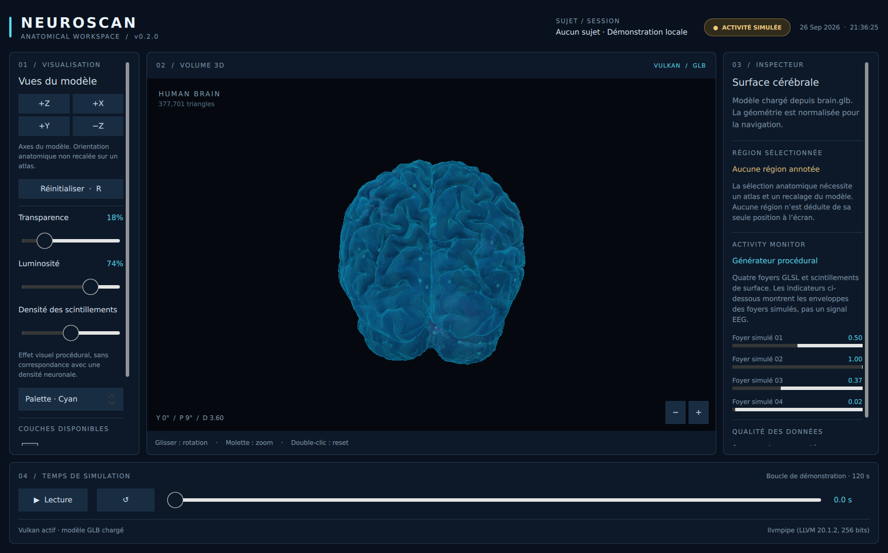

# NeuroScan — 3D Visualization Engine

**An experimental C++20 / Vulkan rendering engine with an interactive Qt Quick interface.**

NeuroScan explores real-time 3D rendering, GPU resource management and the integration of native Vulkan graphics into a desktop application. A detailed brain mesh serves as the demonstration scene for interactive camera navigation, custom GLSL shading and procedural animation.

The current implementation is a specialized visualization engine built around this scene. It is not yet a general-purpose game engine or a scene editor.



## Features

### Vulkan rendering

- Indexed rendering of the included GLB mesh, imported through Assimp.
- Custom vertex and fragment shaders compiled to SPIR-V during the build.
- Depth testing, alpha blending, dynamic viewport and scissor.
- Offscreen color and depth targets, with the color image imported into Qt Quick.
- Shader parameters supplied through Vulkan push constants.
- Surface lighting, view-dependent Fresnel effects and procedural animated hotspots.

The included scene contains **195,887 vertices and 377,701 triangles** after import in the tested build.

### Interactive viewport

- Orbital camera controlled by mouse dragging.
- Mouse-wheel and trackpad zoom, plus on-screen zoom controls.
- Camera reset and presets aligned with the model axes.
- Adjustable transparency and brightness.
- Cyan, amber and monochrome palettes.
- Adjustable density of procedural spark effects.
- Surface visibility and activity-effect toggles.
- Playback, pause and scrubbing through a 120-second procedural animation loop.
- Viewport resizing and device-pixel-ratio-aware render targets.

### Desktop interface

- Qt Quick / QML dashboard with visualization controls and scene information.
- GPU device name and imported triangle count.
- Camera orientation and distance readout.
- Visible initialization and model-loading errors.
- Separate GUI and rendering responsibilities.

The animated effects are generated mathematically. The application does not currently acquire EEG signals, simulate biological neural networks or reconstruct measured brain activity.

## Technology

| Component | Technology |
|---|---|
| Application and renderer | C++20 |
| Graphics API | Vulkan |
| GPU shaders | GLSL / SPIR-V |
| Desktop interface | Qt 6, Qt Quick, QML, Quick Controls |
| Mesh import | Assimp |
| Vector and matrix operations | GLM |
| Build and tests | CMake, CTest |

## Architecture

| Component | Responsibility |
|---|---|
| `qml/Main.qml` | Layout, controls and property bindings |
| `BrainViewport` | GUI-side state, input handling and animation time |
| `BrainTextureNode` | Render-thread integration, offscreen targets and texture import |
| `BrainMesh` | Mesh import, normalization, vertex/index buffers and graphics pipeline |
| `Camera` | Orbital navigation and Vulkan-compatible projection |
| `brain.vert` / `brain.frag` | Vertex transformation, lighting and procedural effects |

Qt owns the Vulkan instance, device, graphics queue, swapchain and frame submission. NeuroScan uses Qt's device and command buffer to record its own rendering commands into an offscreen target before the Qt Quick render pass.

The resulting image is exposed through `QSGVulkanTexture::fromNative` and displayed as part of the QML scene. The interactive viewport does not require a CPU readback of the rendered brain.

Mutable camera and rendering settings are copied during scene-graph synchronization, while the GUI thread is blocked. GPU resources belong to the render-thread scene-graph node and are recreated when needed. Device-idle waits are used during target replacement and destruction, rather than in the normal frame loop.

The earlier GLFW/ImGui implementation is preserved in `legacy/` for reference and is excluded from the current build.

## Build and run

### Requirements

- CMake **3.24+**.
- A **C++20** compiler.
- Qt **6.4+**, including Qt Quick and Quick Controls 2.
- Vulkan headers, loader, a compatible driver and the **`glslc`** shader compiler.
- Assimp and GLM.

The application explicitly selects the Vulkan backend. It does not provide an OpenGL or Metal fallback.

### Windows

The following commands use the project's Windows setup: Visual Studio 18 2026, Qt 6.11.2 MSVC x64 and vcpkg. Adjust the paths and generator to match your installation.

Run from the project directory containing `CMakeLists.txt`:

```bat
C:\dev\vcpkg\vcpkg.exe install assimp:x64-windows glm:x64-windows

cmake -S . -B build-qt -G "Visual Studio 18 2026" -A x64 -DCMAKE_PREFIX_PATH="C:\Qt\6.11.2\msvc2022_64" -DCMAKE_TOOLCHAIN_FILE="C:\dev\vcpkg\scripts\buildsystems\vcpkg.cmake"

cmake --build build-qt --config Release --parallel

"C:\Qt\6.11.2\msvc2022_64\bin\windeployqt.exe" --release --qmldir qml build-qt\Release\NeuroScan.exe

build-qt\Release\NeuroScan.exe
```

Use a fresh build directory when migrating from the previous GLFW implementation. Ensure `glslc` is discoverable through the Vulkan SDK or your `PATH`.

The default build copies the model and compiled shaders next to the executable through the `NeuroScanRuntime` target. Build the default target as shown above so this step runs. Keep the `assets/` and `shaders/` directories, Qt runtime files and Assimp dependencies alongside the executable when distributing a build.

### Linux

With the development dependencies above and Ninja installed:

```sh
cmake -S . -B build-qt -G Ninja -DCMAKE_BUILD_TYPE=Release
cmake --build build-qt --parallel
./build-qt/NeuroScan
```

Runtime asset paths are resolved relative to the executable, independently of the working directory.

## Controls

| Action | Input |
|---|---|
| Orbit | Hold the left mouse button and drag inside the viewport |
| Zoom | Mouse wheel, trackpad or + / − buttons |
| Reset camera | Double-click, reset button or R |
| Change view | +Z, +X, +Y and −Z buttons |
| Play / pause | Playback button or Space when not intercepted by a focused control |
| Scrub animation | Drag the timeline; playback pauses |
| Access additional controls | Scroll the side panels |

View presets use the imported model's axes; they are not atlas-registered anatomical views.

## Testing and validation

```bat
ctest --test-dir build-qt -C Release --output-on-failure
build-qt\Release\NeuroScan.exe --smoke-test captures
```

`CameraTest` checks camera bounds, finite matrices, view presets and the Vulkan depth range. The application smoke test exercises mouse input, rendering settings, resizing, scene-graph recreation and surface visibility, and saves seven screenshots for inspection.

| Environment | Verification |
|---|---|
| Windows, project owner's PC | Successful compilation and launch confirmed by the owner |
| Linux, Qt 6.4.2, Mesa llvmpipe | Compilation, camera tests, Vulkan rendering, input, resizing, 150% display scaling and missing-model handling tested during development |
| macOS / MoltenVK | Not validated for this version |

Standard Vulkan validation reported no errors in the final Linux smoke tests. Extended synchronization validation produced diagnostics involving Qt-managed presentation and buffer operations; presentation diagnostics also reproduced in a Qt-only baseline. These findings remain documented rather than treated as fully resolved.

See [the detailed validation report](docs/VALIDATION.md) for test coverage and logs. That report records the original Linux delivery; the Windows build-and-launch confirmation was obtained afterwards. Linux tests used a software Vulkan implementation and are not RTX 4060 performance benchmarks.

## Current limitations

- A single predefined demonstration scene; no general scene editor or runtime model browser.
- Mesh geometry and normals are imported, but glTF materials and textures are not rendered.
- Conventional alpha blending with depth testing; no order-independent transparency.
- Synchronous model loading at initialization and scene-graph recreation.
- Static mesh buffers use host-visible coherent memory; no staging/device-local upload path yet.
- Render targets are capped at 4096 pixels per dimension while preserving aspect ratio.
- No session persistence, recording, external signal import or EEG acquisition.
- No anatomical segmentation, atlas mapping or individual-neuron representation.

## Rendering roadmap

Planned work, not current functionality:

- [ ] Save and restore camera and visualization presets.
- [ ] Add runtime model selection and stronger import diagnostics.
- [ ] Profile GPU time and memory usage on hardware Vulkan devices.
- [ ] Introduce asynchronous loading and staging-buffer uploads where profiling justifies them.
- [ ] Improve transparency for overlapping surfaces.
- [ ] Expand lighting and material controls.
- [ ] Add independently selectable scene objects and rendering layers.
- [ ] Extend automated build and rendering validation.

## Development

NeuroScan is a personal graphics-programming project by **Kilian Berardino**. Its development focuses on understanding rendering architecture, connecting a native graphics API to a desktop UI and making interactive rendering behavior testable.

AI assistance was used substantially for the Qt Quick/Vulkan integration, implementation, debugging and documentation. The Windows build and launch were checked by the project owner; the Linux verification described above was performed in the AI-assisted development environment.

## Model attribution

The included `brain.glb` identifies the following source and license in its embedded metadata:

- **Model:** [Brain](https://sketchfab.com/3d-models/brain-cadd2bde67404c43b2359a6a3281d84a)
- **Author:** [dgallichan](https://sketchfab.com/dgallichan)
- **License:** [Creative Commons Attribution 4.0](https://creativecommons.org/licenses/by/4.0/)

The source GLB is unchanged. Geometry is centered and normalized in memory for rendering, and the application applies its own shaders. The model's license applies to that asset and does not establish a license for the application's source code.
